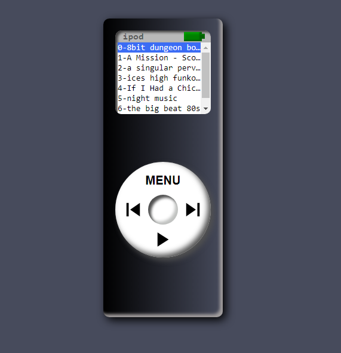

# 

  <h1><b>📱🎵🎧 IPod style audio player with CSS 🎧🎵📱</b></h1>
  <h6>by <i>FranciscoCharles</i></h6>

Este é apenas um resultado prático do uso da API de audio nativo dos browers visando criar uma
um player de audio. O objetivo foi criar uma aparencia simples, então lembrei da forma de um IPod, principalmente
para servir de desafio de CSS, além disso o IPod é funcional, sendo possivel dar play/pause nas músicas, tambem é possivel interagir com o display fazendo as musicas serem tocas apenas clicando nelas. A parte de front desse app foi **inteiramente construida usando CSS puro**, nenhuma imagem foi utilizada, exceto os icones do para os botoes **prev**, **play/pause** e **next**.

    
     
    <h6>
        Figure 1 - IPod criado com CSS. Os nomes das musicas
        utilizadas são do compositor Kevin MacLeod. Todas disponiveis no <a href="https://www.youtube.com/playlist?list=PLrwYF1Q780z-5naGR0lBXRC-mVfg5OmxI" alt="playlist">youtube</a>
    </h6>

# <a name=index>Indice📚</a>

- [**Técnologias usadas**](#tecno)
- [**Licença do projeto**](#license)

# **<a name=tecno>🔮🔮🔮 Técnologias usadas </a>** <h6>[voltar ao indice](#index)</h6>

+ **HTML**
+ **CSS**
+ **JS Puro**
+ [**Ionicons**](https://ionic.io/ionicons/v4)

# **<a name=license>Licença</a>**  <h6>[voltar ao indice](#index)</h6>

Para mais informações sobre a licença deste projeto, leia o arquivo <a href="./LICENSE" title="go to license file">LICENSE</a>.

---

    Copyright © 2021 <b>FranciscoCharles</b>

